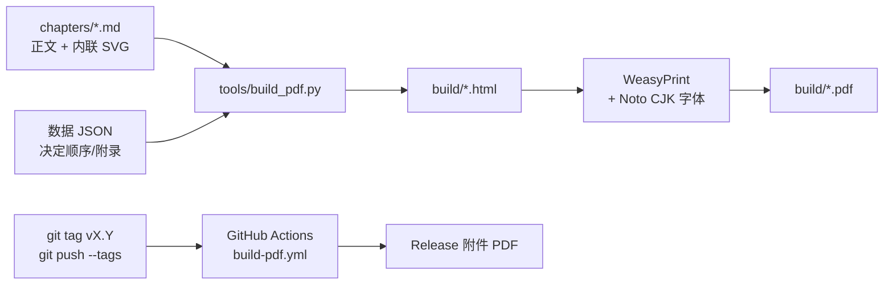

# 维护说明（MAINTAINING）

> 一句话：**改 Markdown → `make check` → `make pdf` 看效果 → commit → 打 tag 发版。**

## 1. 出书流程一张图



## 2. 文件夹结构

```text
domains/NN-<领域>.md           # 17 篇正文（@intro 导读 + 每个词条一块，格式见标准 §4）
front/                       # 怎么读、全书地图、第一性原理导读、sources-<领域>.md 核实记录、cover.svg
data/src/*.txt               # 词条总表（唯一源头）：id、中英名、年份、级别、定义、相关词条、原理
data/entries.json            # 由 compile_entries.py 生成（别手改）
data/index_keys.json         # 拼音索引排序键（make_index_keys.py 生成）
assets/figs/<领域>/            # SVG 图（由 tools/figs_<领域>.py 生成）
tools/build_pdf.py           # 排版：entries.json + domains → HTML → PDF，自动生成索引与年表
tools/compile_entries.py 等   # 词条数据工具：编译、插入、按领域局部更新
tools/figs_*.py / svgkit.py  # 图解生成脚本与绘图库；preview_figs.py 预览成 PNG
tools/factcheck.py           # 批量用维基百科正文核对年份/关键词（需联网）
```

`build/` 是生成物，已在 `.gitignore`，不要提交。

## 3. 改一章

1. 打开对应的 `.md` 文件直接改（目录见 README）。
2. 第一行 `# 标题` 是章标题，会进 PDF 目录；`##` / `###` 是小节。
3. 段落短一点：**每节第一句写结论**，一段一个意思。
4. 跑 `make check`（应输出 `errors=0`），再跑 `make sample` 或 `make pdf` 看排版。
5. `git commit -m "改：第 N 章 …"`。

## 4. 加一张图（内联 SVG 约定）

图直接写在 Markdown 里，用 ```` ```svg ```` 代码块包起来，构建脚本会把它变成 PDF 里的矢量图：

````markdown
```svg
<svg xmlns="http://www.w3.org/2000/svg" viewBox="0 0 800 400">
  <rect width="800" height="400" fill="#ffffff"/>
  <text x="400" y="40" font-size="22" text-anchor="middle">标题 / Title</text>
</svg>
```
*图 N-x：这张图证明了什么（一句话）*
````

- **必须有 `viewBox`**（`width`/`height` 会被脚本去掉，按版心宽度缩放）。
- 字体不用写，脚本统一套 Noto Sans CJK SC；最小字号 ≥ 11（打印可读）。
- 图里的数字也要有来源编号或「估」字样。
- 图不是手写在正文里，而是**改 `tools/figs_<领域>.py` → 运行它 → 生成 `assets/figs/<领域>/*.svg`**，正文里按路径引用。
- 调色板固定为 `svgkit.C`；概念地图用 ` ```svg map `（整页），小图用 ` ```svg small `；每张图配一句 `图注：`。
- `python3 tools/preview_figs.py <领域>` 把图渲染成 PNG 到 `build/preview/`，目视检查后再出 PDF。

## 5. 加 / 改数据

- **词条数据的唯一源头是 `data/src/*.txt`**：加词条、改名、改年份、改相关词条 → 改 txt → `make entries`（重建 `data/entries.json`）→ 一起提交。只动几个领域时可用 `tools/patch_entries_domains.py <领域…>`。
- **增删或改名词条后**跑 `make index-keys`（需要 `pip install pypinyin`），否则拼音索引会退回按字符编码排序并打印警告。
- 正文在 `domains/NN-<领域>.md`，每个词条的字段（是什么 / 原理 / 怎么工作 / 年份人物 / 改变了 / 注意 / 图注）格式见 `PUBLISHING_STANDARD.md` §4；构建时会报告缺失正文、长度越界、A 级缺图和未知交叉引用。
- 核实记录写在 `front/sources-<领域>.md`，会合并进附录二；新查证或更正的数据注明访问时间。

## 6. 内容硬规则（来自出版标准）

完整标准见 **[PUBLISHING_STANDARD.md](PUBLISHING_STANDARD.md)**，下面只列硬规则。

1. **求全不求深**：每个词条只讲清「是什么、为什么行、怎么工作、谁何时、改变了什么」，篇幅守 A/B/C 级硬限。
2. **第一性原理**：每个词条至少挂一条根原理，讲「为什么行得通」，不只讲「是什么」。
3. **不编造**：年份、人物、数字都要能在公开来源查到；写手凭记忆引用的说法必须联网核对，更正写进 `front/sources-*.md`。
4. **时效**：2025–2026 年的数据注明时间点，统一写「截至 2026 年 10 月」；估算要写明是估算。
5. **常见误解**单列一栏；不用恐吓式或营销式语言；数字用能感受到的量级。
6. 中英对照：术语首次出现写「中文（English）」；年份区间统一用「–」。

## 7. 发一个新版本（Release）

1. 在 `CHANGELOG.md` 顶部加一节，例如 `## v1.1 — 2026-11-01`，写改了什么。
2. 提交并打 tag：

```bash
git add -A && git commit -m "v1.1: 修订第 12 章数据"
git tag v1.1
git push origin main --tags
```

3. GitHub Actions 自动出 PDF，并挂到 **Releases → v1.1**。几分钟后去 Releases 下载核对。

版本号习惯：错别字/小修 `v1.0.1`；改内容或加图 `v1.1`；大改结构 `v2.0`。
