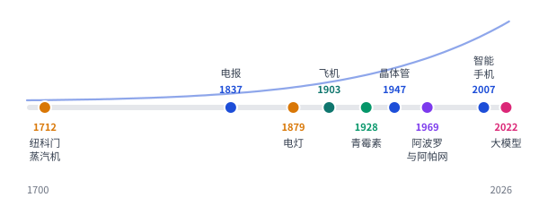

# 近现代科技百科全书

> 从工业革命到大模型：17 个领域、997 个关键词，每个词条讲清是什么、为什么行（第一性原理）、怎么工作、谁何时、改变了什么。求全不求深，通俗、双语、多图。
>
> *An Illustrated Encyclopedia of Modern Technology · 1700–2026*

<p align="center"></p>

## 互动学习网页

**在线阅读：[原来如此 · 完整科技百科](https://teancum.me/tech-encyclopedia/)**

由 GitHub Pages 托管，使用账号已绑定的 `teancum.me` 域名并强制 HTTPS；原 `teancumtian.github.io/tech-encyclopedia/` 地址会跳转到这里。

**「原来如此」** 将书稿变成面向零基础成年人的互动学习网站：

- 4 条学习路线、20 节生活化导学与即时反馈小测；6 个可操作实验。
- 整本书可连续阅读：997 个完整词条、59 条原理、17 篇导读与知识地图、全部前置说明与来源、年表、中英文索引、词条总表；183 张原书图解。
- 1098 个阅读小节，支持前后节、恢复上次位置、已读标记、大字与专注模式。阅读小节与 PDF 页码不同。
- 997 个词条均可翻卡回想；支持按领域、已读、收藏和到期内容复习，以及 20 节导学的小测错题重练。
- 在线版把阅读位置、收藏、笔记和复习进度保存在当前浏览器，支持 JSON 导出/导入；本机服务版继续写入 `learning-data/progress.json` 并保留前一版备份。
- 适配电脑和手机尺寸；无需账户、API 密钥、第三方字体或 npm 依赖。
- 中文、English、中英对照三种模式：界面、整本书、导学、小测和图解均可切换；语言选择与阅读进度一起保存，个人笔记保持原文。

需要 Python 3.9+。在仓库目录运行：

```bash
make web-serve
```

打开 **[本机学习网站](http://127.0.0.1:4173)**。结束预览按 `Ctrl+C`。只构建用 `make web`，完整检查用 `make web-check`（检查还需要 Node.js 20+）。

在线记录不会上传，手机和电脑也不会自动同步；清除网站数据或隐私浏览可能丢失记录，请定期在「我的学习」导出 JSON。将本机记录带到线上：先在本机网页导出，再到线上网页导入。

本机版的项目文件已从 Git 提交排除，重建网页不会清除；备份与恢复见 [学习数据说明](learning-data/README.md)。

### Read in English

Open [Now I See — The Technology Atlas](https://teancum.me/tech-encyclopedia/) and choose **English** in the language menu. Choose **中英对照** to compare Chinese and English passages. The complete book includes 997 entries, 59 principles, 17 chapters and 183 diagrams, alongside learning paths, experiments and review cards.

Reading position, bookmarks and notes stay in your browser. Use **My learning → Export / Import** to make a backup or move your records to another device. All language modes share the same progress, and your own notes remain exactly as you wrote them. English content is a machine-assisted, edited translation of the Chinese manuscript; the existing PDF remains in Chinese. See [translation maintenance](translations/README.md) for the editing workflow.

网页从现有书稿生成，`build/web/` 是产物，不要直接修改。维护和实验模型说明见 [网页维护说明](docs/WEB_MAINTENANCE.md)。推送 `main` 后，GitHub Actions 先检查并构建，再自动部署 `build/web/` 到 GitHub Pages。仓库与网页均按用户授权公开，个人学习数据不包含在发布产物中。

## 这本书里有什么

- **17 个领域、997 个词条**（★ 核心 A 105 条 / 标准 B 244 条 / 短词条 C 648 条）+ **59 条第一性原理**：能源与动力、电与电子、计算与软件、互联网与通信、人工智能、材料与化工、制造、交通、航天、生物医药、农业与食品、建筑与城市、安全与密码、金融科技、环境与气候、媒体与娱乐、前沿科技。
- 每个词条：是什么 → 原理（链接到第一性原理）→ 怎么工作 → 关键年份与人物 → 改变了什么 → 常见误解；中英对照。
- **183 张** SVG 图解（每篇一张知识地图 + 核心词条原理图），全部由 `tools/figs_*.py` 脚本生成。
- 前置：怎么读这本书、全书地图、第一性原理索引；附录：大事年表、资料来源与核实记录、中文拼音索引、English Index。A4 共 549 页。
- 每篇都有核实记录：年份与人物用维基百科正文批量核对，2025–2026 年数据注明时间点。

## 下载 PDF

成书 PDF **不放在 git 里**，在 GitHub **[Releases](../../releases)** 页面下载（每个 `v*` tag 自动生成）。
每次推送到 `main`，Actions 也会把最新 PDF 作为 artifact 上传（Actions → Build PDF → Artifacts）。

## 目录（Table of Contents）

- **[怎么读这本书](front/howto.md)**

- **[全书地图](front/map.md)**

- **[第一性原理索引（导读）](front/principles-intro.md)**
- [第 1 篇　能源与动力（68 条）](domains/01-energy.md)
- [第 2 篇　电与电子（79 条）](domains/02-electronics.md)
- [第 3 篇　计算与软件（124 条）](domains/03-computing.md)
- [第 4 篇　互联网与通信（83 条）](domains/04-internet.md)
- [第 5 篇　人工智能（81 条）](domains/05-ai.md)
- [第 6 篇　材料与化工（54 条）](domains/06-materials.md)
- [第 7 篇　制造与自动化（45 条）](domains/07-manufacturing.md)
- [第 8 篇　交通运输（51 条）](domains/08-transport.md)
- [第 9 篇　航天与空间（39 条）](domains/09-space.md)
- [第 10 篇　生物与医学（107 条）](domains/10-biomed.md)
- [第 11 篇　农业与食品（34 条）](domains/11-agri.md)
- [第 12 篇　建筑与城市（34 条）](domains/12-building.md)
- [第 13 篇　安全与国防（48 条）](domains/13-security.md)
- [第 14 篇　金融与商业科技（37 条）](domains/14-fintech.md)
- [第 15 篇　环境与气候技术（36 条）](domains/15-environment.md)
- [第 16 篇　光学、成像与媒体（47 条）](domains/16-media.md)
- [第 17 篇　量子与前沿（30 条）](domains/17-frontier.md)

## 自己出 PDF（Build）

需要：Python 3.10+、Noto CJK 字体（`Noto Serif CJK SC` + `Noto Sans CJK SC`）、WeasyPrint 的系统库（Pango）。

```bash
# Ubuntu / Debian
sudo apt-get install fonts-noto-cjk fonts-noto-cjk-extra libpango-1.0-0 libpangoft2-1.0-0
# macOS: brew install pango，并安装 Noto Sans CJK / Noto Serif CJK 字体

python3 -m venv .venv && . .venv/bin/activate
pip install -r requirements.txt

make pdf      # 全书 → build/近现代科技百科全书-全书.pdf
make sample   # 样章 → build/样章.pdf
make check    # 检查 SVG、JSON、路径
```

全书参考页数：约 549 页（A4）。字体或 WeasyPrint 版本不同，页数会有几页浮动。

## 怎么维护

改章节、加图、改数据、发版本：见 **[MAINTAINING.md](MAINTAINING.md)**。版本记录见 [CHANGELOG.md](CHANGELOG.md)。

## 版权（Rights）

© 2026 Teancum Tian. **All rights reserved. 保留所有权利。** 本仓库暂未选择开源许可证（no license），
未经许可请勿转载或再发布。书中引用的公司名、产品名和商标归各自所有者；引用的数据和资料以文中标注的来源为准。
